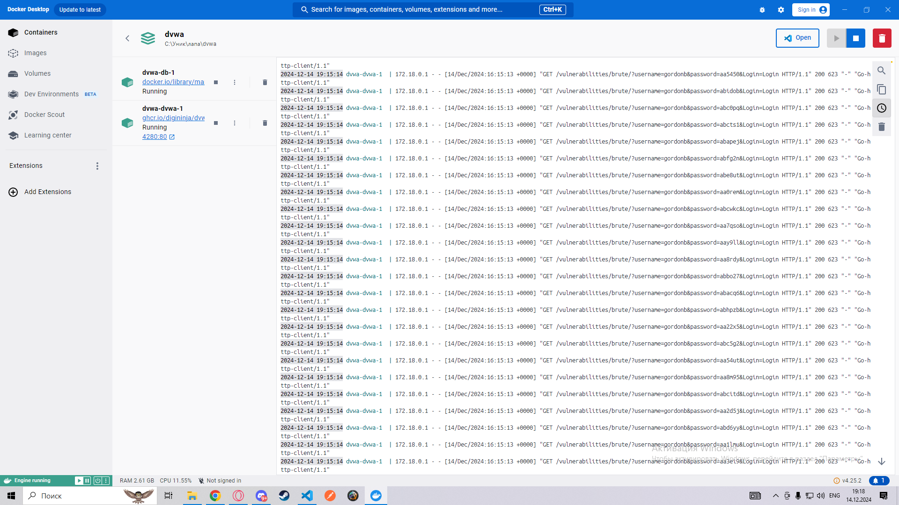
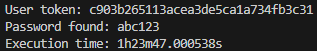

- Склонировать репозиторий [DVWA](https://github.com/digininja/DVWA) и запустить Docker-контейнер ```docker compose up -d```
- Открыть в браузер ```http://localhost:4280```
- Войти в аккаунт админа и скопировать coockie ```PHPSESSID``` из DevTools
- Склонировать репозиторий с brute-force и вставить значение coockie в константу ```userCoockie``` в файле main.go
- Запустить команду ```go mod download```, после чего запустить программу с помощью команды ```go run main.go```

# 1. Brute-force
Логи во время работы программы:

Результат работы программы:


# 2. Кодревью с указанием слабых мест с использованием метрики CWE.

## 1. SQL-инъекции (CWE-89)
**Описание:**  
Данные пользователя (`$user`, `$pass`) вставляются в SQL-запрос напрямую, позволяя злоумышленнику манипулировать запросом.

**Исправление:**  
Используйте подготовленные запросы (prepared statements) и параметры:
```php
$stmt = $mysqli->prepare("SELECT * FROM `users` WHERE user = ? AND password = ?");
$stmt->bind_param("ss", $user, $pass);
$stmt->execute();
```

## 2. Использование устаревшего алгоритма MD5 для хэширования (CWE-327)
**Описание:**  
MD5 уязвим к атакам, включая коллизии и словарные атаки, делая хэширование паролей небезопасным.

**Исправление:**  
Используйте современный алгоритм, такой как ```password_hash``` с ```PASSWORD_BCRYPT```, и проверку через ```password_verify```:
```php
$hash = password_hash($pass, PASSWORD_BCRYPT);
if (password_verify($pass, $hash)) { /* Успешный вход */ }
```

## 3. Отсутствие валидации входных данных (CWE-20)
**Описание:**  
Пользовательские данные (```username```, ```password```) не проверяются, что увеличивает риски SQL-инъекций, XSS и других атак.

**Исправление:**  
Валидируйте входные данные с использованием регулярных выражений или функций фильтрации:
```php
if (!preg_match('/^[a-zA-Z0-9]+$/', $user)) {
    die("Invalid username");
}
```

## 4. Отсутствие защиты от XSS (CWE-79)
**Описание:**  
Данные, такие как ```$user``` и ```$avatar```, выводятся в HTML без экранирования, что позволяет внедрять вредоносные скрипты.
Исправление: Экранируйте выводимые данные с помощью

**Исправление:**  
Экранируйте выводимые данные с помощью ```htmlspecialchars```:
```php
echo htmlspecialchars($user);
echo htmlspecialchars($avatar);
```

## 5. Раскрытие ошибок через die (CWE-209)
**Описание:**  
Сообщения об ошибках базы данных отображаются пользователю, что может раскрыть внутренние структуры приложения.

**Исправление:**  
Логируйте ошибки в файл или системный лог, не показывая их напрямую:
```php
error_log(mysqli_error($GLOBALS["___mysqli_ston"]));
die("An error occurred. Please try again later.");
```

## 6. Использование глобальных переменных для базы данных (CWE-1104)
**Описание:**  
Глобальная переменная ```:$GLOBALS["___mysqli_ston"]```: снижает читаемость и увеличивает риск ошибок.

**Исправление:**  
 Передавайте подключение к базе данных через параметры функций или используйте Dependency Injection.


## 7. Отсутствие защиты от брутфорса (CWE-307)
**Описание:**  
Неограниченное количество попыток входа позволяет злоумышленнику использовать метод полного перебора.

**Исправление:**  
Вводите ограничение на количество неудачных попыток через систему блокировки или задержек:
```php
if (failedAttempts($user) > 5) {
    sleep(5); // Задержка
}
```

## 8. Отсутствие защиты от фиксации сессии (CWE-384)
**Описание:**  
Сессии не защищены от атак, таких как фиксация, так как отсутствуют настройки безопасности для cookies.

**Исправление:**  
Настройте параметры сессии с защитой ```HttpOnly```, ```Secure``` и ```SameSite```:
```php
session_start([
    'cookie_secure' => true,
    'cookie_httponly' => true,
    'cookie_samesite' => 'Strict'
]);
```

# 3. Исправелнный код

```php
<?php

if( isset( $_POST[ 'Login' ] ) && isset( $_POST['username'] ) && isset( $_POST['password'] ) ) {
    // Проверка CSRF токена
    checkToken( $_REQUEST['user_token'], $_SESSION['session_token'], 'index.php' );

    // Санитизация имени пользователя
    $user = $_POST['username'];
    $user = stripslashes($user);
    $user = htmlspecialchars($user, ENT_QUOTES, 'UTF-8');  // Эксплицитное экранирование от XSS

    // Санитизация пароля
    $pass = $_POST['password'];
    $pass = stripslashes($pass);
    $pass = htmlspecialchars($pass, ENT_QUOTES, 'UTF-8');  // Эксплицитное экранирование от XSS
    $pass = password_hash($pass, PASSWORD_BCRYPT);  // Использование безопасного хэширования

    // Проверка данных в базе
    $data = $db->prepare('SELECT failed_login, last_login, password, avatar FROM users WHERE user = :user LIMIT 1');
    $data->bindParam(':user', $user, PDO::PARAM_STR);
    $data->execute();
    $row = $data->fetch();

    // Проверка блокировки пользователя
    $account_locked = false;
    if ($data->rowCount() == 1 && $row['failed_login'] >= 3) {
        $last_login = strtotime($row['last_login']);
        $timeout = $last_login + (15 * 60);  // 15 минут блокировки
        $timenow = time();

        if ($timenow < $timeout) {
            $account_locked = true;
        }
    }

    // Проверка пароля и учетной записи
    if ($data->rowCount() == 1 && !$account_locked) {
        // Проверка пароля
        if (password_verify($_POST['password'], $row['password'])) {
            // Успешный вход
            $avatar = $row['avatar'];

            // Вывод успешного входа
            $html .= "<p>Welcome to the password protected area <em>" . htmlspecialchars($user, ENT_QUOTES, 'UTF-8') . "</em></p>";
            $html .= "";

            // Сброс счетчика неудачных попыток
            $data = $db->prepare('UPDATE users SET failed_login = 0 WHERE user = :user LIMIT 1');
            $data->bindParam(':user', $user, PDO::PARAM_STR);
            $data->execute();
        } else {
            // Неверный пароль
            sleep(rand(2, 4));  // Задержка для предотвращения брутфорса

            // Вывод ошибки
            $html .= "<pre><br />Username and/or password incorrect.<br /><br/>Alternatively, the account has been locked because of too many failed logins.<br />If this is the case, <em>please try again in 15 minutes</em>.</pre>";

            // Увеличение счетчика неудачных попыток
            $data = $db->prepare('UPDATE users SET failed_login = failed_login + 1 WHERE user = :user LIMIT 1');
            $data->bindParam(':user', $user, PDO::PARAM_STR);
            $data->execute();
        }
    } else {
        // Если аккаунт заблокирован
        if ($account_locked) {
            $html .= "<pre><br />This account has been locked due to too many incorrect logins. Please try again in 15 minutes.</pre>";
        } else {
            // Неверное имя пользователя
            $html .= "<pre><br />Username and/or password incorrect.</pre>";
        }
    }

    // Обновление времени последнего входа
    $data = $db->prepare('UPDATE users SET last_login = NOW() WHERE user = :user LIMIT 1');
    $data->bindParam(':user', $user, PDO::PARAM_STR);
    $data->execute();
}

// Генерация CSRF токена
generateSessionToken();

function generateSessionToken() {
    // Генерация нового CSRF токена
    if (isset($_SESSION['session_token'])) {
        destroySessionToken();
    }
    $_SESSION['session_token'] = md5(uniqid());
}

function destroySessionToken() {
    // Удаление CSRF токена
    unset($_SESSION['session_token']);
}

?>

```